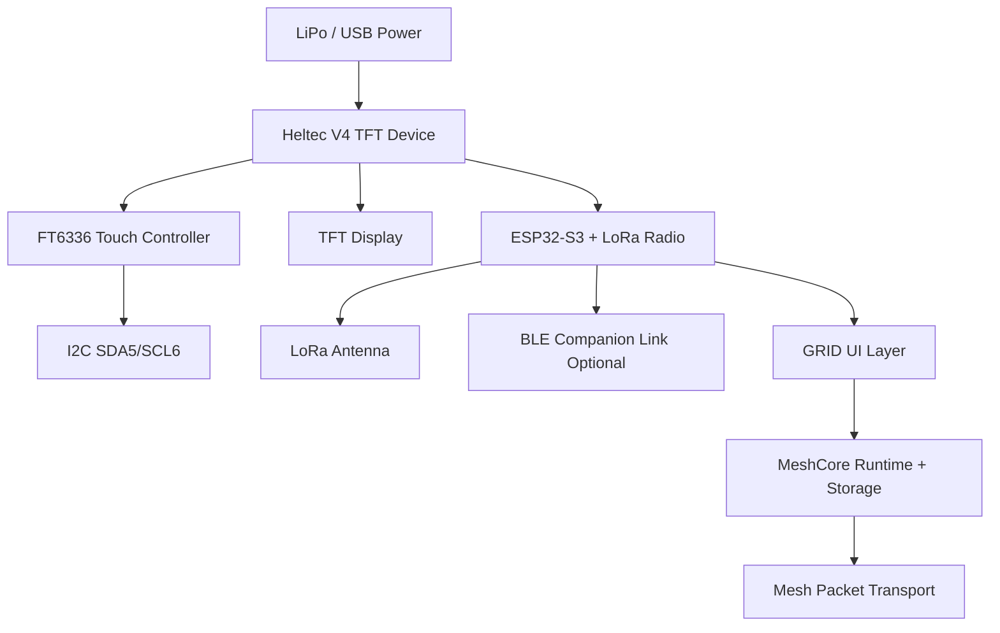

# MeshcoreGRID

MeshcoreGRID is a touch-first handheld firmware built on MeshCore.

This repository keeps MeshCore as the runtime and protocol source of truth, while GRID provides a full on-device UI layer for chat, discovery, radio controls, BLE controls, settings, and power management.

Current testing build line:

- GRID: `v0.7.1-BETA1`
- Firmware string: `v1.15.0-GRID-BETA1`

## Project Focus

MeshcoreGRID focuses on a practical, standalone touchscreen mesh handheld experience.

Key goals:

- Keep MeshCore transport and persistence behavior intact.
- Keep UI state in GRID, persistent mesh state in MeshCore.
- Make daily device usage possible without companion app dependency.

## Upstream MeshCore

MeshcoreGRID is based on MeshCore.

- Upstream project: https://github.com/meshcore-dev/MeshCore

Credits:

- Massive thanks to the MeshCore maintainers and contributors.
- This GRID project would not exist without their protocol, routing, radio, storage, and device support foundation.

## Supported GRID Target

- `heltec_v4_tft_grid_os_ble`

Hardware assumptions for this build:

- Heltec V4 TFT display
- FT6336 touch controller (`0x38`) on SDA=5, SCL=6, RST=41
- LoRa + BLE enabled firmware variant

## Feature Overview

### Global UI

- Top status bar with SNR/signal bars, BLE indicator, battery percentage
- Contextual bottom navbar actions
- Home screen hides bottom navbar for full-height layout
- RX-while-screen-off wake toast
- Screen timeout with persisted value

### Home App

- GRID app launcher cards
- Live unread badge for Messenger

### Messenger App

- Channel chat + direct-message chat
- Contacts list from MeshCore memory
- Manual contact sync button (`Sync`) to refresh GUI list from MeshCore state
- Favorites filter (`FAV`) for contacts
- Long-press contact details popup
- Favorite flag writes to MeshCore contact flags (persistent across reboot)
- DM delivery state updates:
  - `* Sent`
  - `* ACK heard • Delivered`
- Channel and DM title bars show actual channel/contact names

### Discover App

- Shows adverts heard since boot
- Empty-state center popup when no adverts
- Conditional add button for unknown nodes
- Add button auto-hides once node exists in MeshCore contacts

### Radio App

- Manual advert actions: zero-hop and flood
- Metrics view: radio and runtime counters

### BLE App

- Enable/disable BLE
- Show BLE state and connection state
- Show active BLE PIN

### Settings App

- Node name
- Frequency / BW / SF / CR / TX power
- BLE PIN
- Screen timeout

### Power App

- Battery millivolts
- Reboot
- Hibernate

## Connection Diagram



## Build And Flash

Prerequisites:

- VS Code
- PlatformIO extension

Commands:

1. Build

```bash
pio run -e heltec_v4_tft_grid_os_ble
```

2. Flash

```bash
pio run -e heltec_v4_tft_grid_os_ble -t upload
```

## Precompiled Binary

For quick testing without rebuilding, use:

- [bin/heltec_v4_tft_grid_os_ble/v0.7.1-BETA1/firmware.bin](bin/heltec_v4_tft_grid_os_ble/v0.7.1-BETA1/firmware.bin)

This binary is built for the `heltec_v4_tft_grid_os_ble` environment.

## Changelog


### v0.7.1-BETA1

- MAP app: scale bar overlay, overlay zoom controls, pinch-to-zoom, and node culling improvements
- MAP app: zoom range now 10m (min) to 200km (max)
- MAP app: only overlay zoom controls remain (toolbar zoom removed)
- General: build, flash, and runtime stability improvements

### v0.7.0-BETA1

- Added persistent Favorites using MeshCore contact flag bit (`flags & 0x01`)
- Added manual contact sync button to refresh GUI list from MeshCore memory
- Added DM ACK delivery pipeline and status updates (`* ACK heard • Delivered`)
- Added contextual navbar-left back action and hid navbar on Home
- Updated chat title to show real channel/contact names instead of generic labels
- Reworked contact details popup layout and action controls to avoid overlap
- Improved Discover empty-state behavior and add-button auto-hide logic
- Updated splash screen pacing/animation and marked build line as BETA

## Repository Structure

- [examples/grid_os/main.cpp](examples/grid_os/main.cpp): GRID firmware entry + splash + system loop
- [src/grid/App_Messenger_Stub.cpp](src/grid/App_Messenger_Stub.cpp): Messenger UI, contacts, DM/channel views
- [src/grid/App_Modules.cpp](src/grid/App_Modules.cpp): Discover, Radio, BLE, Settings, Power modules
- [src/grid/WindowManager.cpp](src/grid/WindowManager.cpp): global shell, bars, app switching
- [examples/companion_radio/MyMesh.cpp](examples/companion_radio/MyMesh.cpp): MeshCore integration and contact persistence path

## Notes For Testers

- This is a BETA stream build.
- UI and flow are actively evolving.
- MeshCore protocol behavior is preserved as much as possible while GRID adds UI capability.

## License

MeshCore and MeshcoreGRID are distributed under the MIT License.
