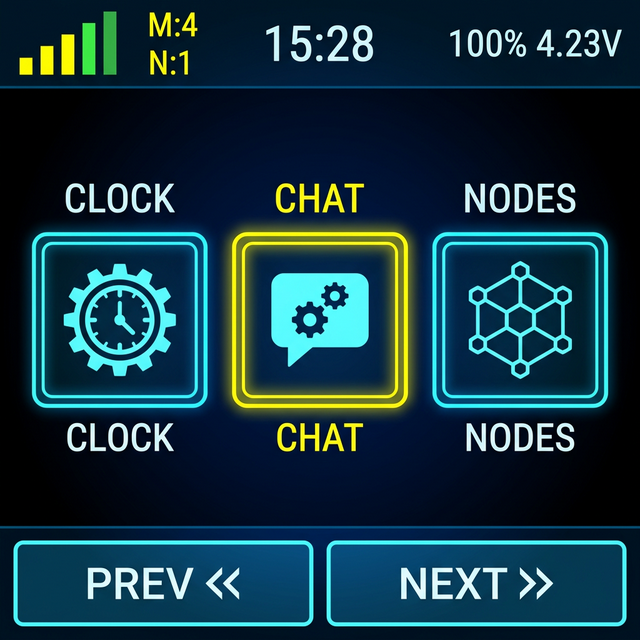

# Meshcore-Touch


MeshCore is a lightweight, portable C++ library that enables multi-hop packet routing for embedded projects. This specialized **"TOUCH" Edition** is optimized for the Heltec v4 (ESP32-S3), featuring a dark-mode UI and touch interactivity.

> [!WARNING]
> **BETA VERSION**: This project is in active development. Features and UI are subject to change.

## 📱 Touch Interface Overview



> [!NOTE]
> **GUI Disclaimer**: The image above is a **digital mockup** intended to demonstrate the general layout and functional goals of the interface. The actual on-device graphics, icons, and layout details may differ in current software builds.

The "TOUCH" edition features a custom-built interface designed for high-contrast visibility and reliable operation on embedded hardware.

### Key interface features:
- **High-Contrast UI**: Black background with Amber/Orange accents for visibility in various lighting conditions.
- **Navigation**: 3-icon carousel for access to core functions.
- **Ergonomic Design**: Enlarged touch targets and a QWERTY keyboard for direct input.
- **Status Indicators**: Bar showing unread messages (✉), node counts (⛫), and battery status.

---

## ⚡ Quick Start (Flashing)

If you just want to get up and running quickly with the latest stable build:

1. **Download**: [Heltec_v4_2.4inch_touchUI_v1.13.0_v1.2.3.bin](./bin/Heltec_v4_2.4inch_touchUI_v1.13.0_v1.2.3.bin)
   - *MeshCore v1.13.0 + Touch v1.2.3*
2. **Flash**: Use the [MeshCore Flasher](https://flasher.meshcore.co.uk) (select Custom File) or use `esptool`:
   ```bash
   esptool.py --chip esp32s3 write_flash 0x10000 bin/Heltec_v4_2.4inch_touchUI_v1.13.0_v1.2.3.bin
   ```
3. **Finish**: The device will boot directly into the touch interface.

---

## 🛠️ Building from Source

For developers who want to customize or contribute to the project:

1. **Prerequisites**: [Visual Studio Code](https://code.visualstudio.com/) + [PlatformIO IDE](https://platformio.org/).
2. **Clone & Build**:
   ```bash
   git clone https://github.com/Quark1980/Meshcore-Touch.git
   pio run -e heltec_v4_tft_touch_companion_radio_ble
   ```
3. **Upload**:
   ```bash
   pio run -e heltec_v4_tft_touch_companion_radio_ble --target upload
   ```

---

## 🔌 Hardware Connection Guide

### Wiring Diagram (Heltec v4 to ST7789 + XPT2046)

| Component | Function | Heltec v4 Pin |
|-----------|----------|---------------|
| **TFT**   | SCLK     | GPIO 17       |
| **TFT**   | MOSI/SDA | GPIO 33       |
| **TFT**   | CS       | GPIO 15       |
| **TFT**   | DC       | GPIO 16       |
| **TFT**   | RESET    | GPIO 18       |
| **Touch** | T_CLK    | GPIO 17       |
| **Touch** | T_DIN    | GPIO 33       |
| **Touch** | T_DO     | GPIO 42       |
| **Touch** | T_CS     | GPIO 3        |
| **Touch** | T_IRQ    | GPIO 4        |

### Connection Details:
- **Shared SPI Bus**: `SCLK` (GPIO 17) and `MOSI` (GPIO 33) are shared. Wire both components to these same physical pins.
- **Dedicated Chip Select**: TFT uses `GPIO 15`, Touch uses `GPIO 3`.
- **Power**: Connect `VCC` to `3.3V` or `VEXT`. Ensure the external power rail is enabled if using `VEXT`.

---

## 🚀 Software Features

- **Custom Icons**: High-resolution 64x64 RGB565 icons.
- **Module Navigation**:
  - **CLOCK**: Time and date display.
  - **CHAT**: Encrypted messaging with unread status.
  - **NODE**: Discovery and node tracking.
  - **RADIO/CFG**: Hardware and device configuration.
  - **LOG/BLE/PWR**: Diagnostics and power management.
- **Message Tracking**: Counter for mesh propagation status.
- **External Sync**: BLE integration maintains history with external applications like MeshCore Mobile.
- **Efficiency**: Backlight and redraw management for power reduction.

> [!NOTE]
> **Development Status**: Certain features like propagation tracking and updated BLE logic are in testing. Please report any issues.

---
*Created by Quark1980 & The MeshCore Community*
